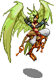
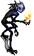

# Grand Mastering

Becoming a Grand Master involves summoning and defeating each of the four creants of temuair. These are lengthy quests that will reward you with very powerful equipment or abilities.

 

<table style="border: 0px">
    <tr>
        <td>

</td>
        <td>

</td>
        <td>

</td>
        <td>

</td>
    </tr>
    <tr>
        <td>
<b>Lady Phoenix</b>
</td>
        <td>
<b>Shamensyth</b>
</td>
        <td>
<b><a href="../../quests/medusa">Medusa</a></b>
</td>
        <td>
<b>Tauren</b>
</td>
</table>

