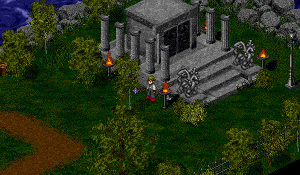

# Classes Overview

<figure>
  
  <figcaption>The Temple of Choosing</figcaption>
</figure>

## Choosing a Class

Every Aisling starts their adventure as a Peasant. However, you can choose your path at level 5 at the Temple of Choosing in Mileth. This will likely be one of the most important choices you make. There are five paths an Aisling can go down: Monk, Priest, Rogue, Warrior, and Wizard. Every class has unique strengths and weaknesses:

**Monk**: Monks fight with their powerful hands and feet. They are very defensive and have a variety of useful spells.

**Priest**: Priests support their group with healing spells, as well as a variety of beneficial spells and curses.

**Rogue**: Rogues excel when fighting indirectly: studying their enemies, attacking from behind, and using traps.

**Warrior**: Warriors fight with a variety of weapons and shields. They want to get in close and hit the enemy hard.

**Wizard**: Wizards are the masters of magic elements. They cast elemental spells and augment or change the elements of their enemies.

## Class Names

While your class name remains the same if you do not choose a [subpath](../subbing), those who do subpath will be given a class name according to the combination of their first class and second class.

| ↓ First / Second → | **Monk** | **Priest** | **Rogue** | **Warrior** | **Wizard** |
| - | - | - | - | - | - |
| **Monk** | Monk | Druid? | Blackguard | Warmonger | Geomancer |
| **Priest** | Druid? | Priest | Vagabond | Paladin | Scholar |
| **Rogue** | Sura | Shadowpriest | Rogue | Mercenary | Shadowmage |
| **Warrior** | Champion | Crusader | Chaser | Warrior | Swordmage |
| **Wizard** | Dark Druid | Cleric | Trickster | Stormbreaker | Wizard |

## Super Peasant

There is an additional hidden class: the Super Peasant. Please read the [Super Peasant](../super_peasant) page for more information.

