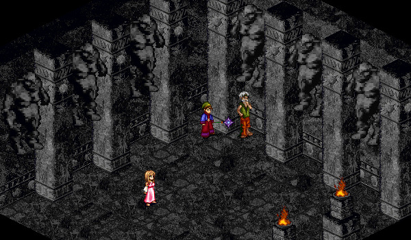

# Subbing

<figure>
  
  <figcaption>Bedor in the Temple of Choosing</figcaption>
</figure>

Subbing involves abandoning your current path and selecting another path to follow. In doing so, you will return to Level 1 of the new path and will forever be considered to be of your second path. You will never obtain the master-level skills and spells of your first path, but will bring whatever skills and spells you've learned already into your second path.

Speak with Bedor (the mysterious old man) in the Temple of Choosing in Mileth to find out more information about walking another path.

## Requirements

The requirements in order to choose a new path depend on the class you are subbing **into**. If you do not meet these requirements, you will need to ascend in order to gain more health or mana.

| **Subbing Into** | **Requirements** |
| - | - |
| Monk | 6,500 Base Health   100M XP |
| Priest | 4,500 Base Mana   100M XP |
| Rogue | 4,000 Base Health   3,500 Base Mana   100M XP |
| Warrior | 6,500 Base Health   100M XP |
| Wizard | 4,500 Base Mana   100M XP |

## Quest

In order to subpath, you will be required to bring a Decree of Deviation to Bedor (the mysterious old man) in the Temple of Choosing in Mileth. A Decree of Deviation can be obtained from Javelin on CR42 by trading 200 Cthonic Scripts for one Full Cthonic Scripture and trading the scripture back to Javelin for a Decree of Deviation. There are no enemies on CR42.

Cthonic Scripts only drop from monsters in the Cthonic Remains, between floors 32-49. They have a drop chance of approximately 20%, so it may take some time to collect a full set of 200 Cthonic Scripts. However, there is a boss on CR38 and another on CR50 that rewards 10 and 20 Cthonic Scripts, respectively, to each member of the party that defeat the boss. These boss fights can be repeated every two hours.

## Considerations

- With items, fragments, and upgraded gear, it is possible to get all pre-master skills and spells before subbing. However, this will be especially difficult for Wizards.
- If you are a Priest, remember to obtain your god's relic before subbing.
- Remember to get all of your [class specializations](../specializations)!
- You can continue to wear any gear that you're wearing when you sub, so select this gear carefully and consider weight restrictions. You will not be able to change elemental necklaces if you are overweight. You may also wish to enable 'Weapon Lock' or 'Equipment Lock' in the settings menu, so you don't accidentally unequip any gear.
- Even if you are subbing from a Priest or Wizard, you may wish to equip an elemental necklace to make the first few levels of your new path a little bit easier.

