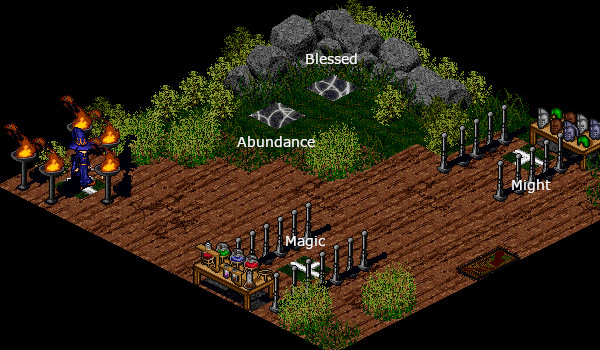

# Enchanting

<figure>
  
  <figcaption>The Suomi Conjurer, where Enchanting is Performed</figcaption>
</figure>

## Overview

Enchanting is performed by all classes in the Suomi Conjurer in Suomi (15, 72). You can only enchant items that do not have any enchantment or consecration on them. In order to enchant an item, drop the item onto the tile that bestows the enchantment. It is possible to fail to enchant an item, in which case the item is destroyed.

## Effects

| Enchantment | Effect |
| - | - |
| Abundance |  |
| Magic | Appears to remove mana reduction penalty. |
| Might | +100 HP |
| Blessed |  |

