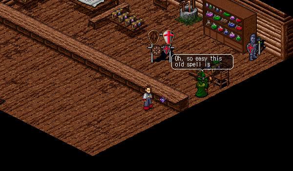

# Fragments

<figure>
  
  <figcaption>A Fragment Sparkling on the Ground</figcaption>
</figure>

## Overview

Fragments are the titular element of Fragments of Temuair. Fragments have a very low chance (estimated 1/250 - 1/1000) of dropping when killing an enemy. Each enemy has the potential of dropping a fragment unique to that named enemy (i.e. 'Mantis', 'Grimlock Guard'). These fragments can be used to empower items, like an enchantment, which provides the item with additional effects. Some effects are seemingly minor, such as Fragment of Viper (+25 HP), whereas other fragments can potentially define entire character playstyles, such as Fragment of Medusa (-1 Spell Lines) and Fragment of Shamansyth (allows any weapon to be used by Rogues).

## Usage

Items are empowered by fragments by placing the item you wish to empower in the first slot of your inventory and double-clicking the fragment. A window explaining the fragment will appear and you will be able to confirm that you wish to expend the fragment to empower the item. Each fragment can only empower a single type of item (i.e. boots, gloves, etc.). When a fragment is used, it is destroyed.

You can empower a single item with up to two fragments. These can be two of the same type of fragments or different types of fragments.

When you empower an item with a fragment, its name will change to reflect that it is empowered. If you are the first player to create a particular fragment-item combination, you will have 'discovered' the item, and it will be announced to the entire server. You will also gain a legend mark reflecting the number of items you have discovered.

## Removing Fragments

<figure>
  
  <figcaption>Randel in the Tagor Dark Wizard Shop</figcaption>
</figure>

You can remove fragments from armour by visiting Randel at the Tagor Dark Wizard. You have the option of destroying the item to preserve and reclaim the fragments (one or both) or destroying the fragments to preserve and reclaim the item. This will cost you 250,000 Gold. You cannot preserve both the item and the fragments.

