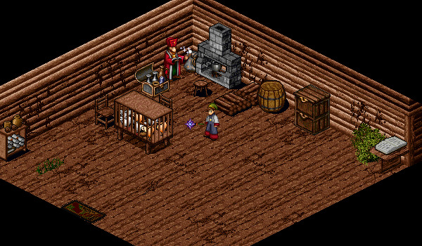

# Staff Crafting

<figure>
  
  <figcaption>The Woodland Cottage in East Woodlands</figcaption>
</figure>

Priests and Wizards are able to craft staves by speaking to the Woodland Priest in a house in East Woodlands 5-1 (92, 11). This requires 250,000 Gold, a strong stick (found by walking around EW 5-1), and some polished gems, depending on the staff you wish to create. You must be at least level 20 to craft a staff.

## Priest Staves

| **Name** | **Requirements** |
| - | - |
|    Holy Apollo | 1 Finished Ruby   Strong Stick   250,000 Gold |
|    Holy Diana | 2 Finished Coral   Strong Stick   250,000 Gold |
|    Holy Kronos | 1 Uncut Beryl   Strong Stick   250,000 Gold |
|    Holy Gaea | 1 Uncut Coral   Strong Stick   250,000 Gold |
|    Holy Zeus | 2 Finished Beryl   Strong Stick   250,000 Gold |

## Wizard Staves

| **Name** | **Requirements** |
| - | - |
|    Magus Apollo | 1 Finished Ruby   Strong Stick   250,000 Gold |
|    Magus Diana | 2 Finished Coral   Strong Stick   250,000 Gold |
|    Magus Kronos | 1 Uncut Beryl   Strong Stick   250,000 Gold |
|    Magus Gaea | 1 Uncut Coral   Strong Stick   250,000 Gold |
|    Magus Zeus | 2 Finished Beryl   Strong Stick   250,000 Gold |

