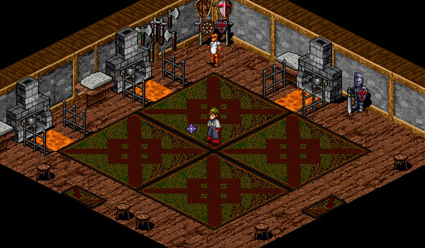

# Upgrading Weapons and Armour

<figure>
  
  <figcaption>Tagor Forge</figcaption>
</figure>

You can upgrade items by speaking with Maldor at Tagor Forge. In order to upgrade items, you spend 100,000 Gold to attempt to upgrade the item in your first inventory slot. If the upgrade is successful, the item improves by +1 upgrade and some abilities may be unlocked for the item. If the upgrade is unsuccessful the item is destroyed.

You can ask Maldor to create a Talgonite Bar from 10 Talos Fragments. When upgrading items, if you spend 100,000 Gold and a Talgonite Bar, then if the upgrade is unsuccessful, the item isn't destroyed. However, both the Gold and the Talgonite Bar are consumed, regardless of whether the upgrade was successful or not.

You cannot upgrade gear that is enchanted with Fragments. You must first remove the fragments, thereby destroying either the fragments or the item. If you are the first player on the server to upgrade a particular item to a new upgrade level, you will have 'discovered' the upgraded item, and it will be announced to the entire server. You will also gain a legend mark reflecting the number of items you have discovered.

## Earrings

(Test on Deoch Coral Earrings)

| **Upgrade Level** | **Effect** |
| - | - |
| 5 | +1 to All Stats |
| 10 | +1 to All Stats   -1 AC   +1% Drop Rate   +1% XP |

## Gloves

(Tested on Deoch Leather Gauntlets)

| **Upgrade Level** | **Effect** |
| - | - |
| 2 | -1 Weight Reduction |
| 5 | +1 to All Stats |

## Greaves

(Tested on Deoch Leather Greaves)

| **Upgrade Level** | **Effect** |
| - | - |
| 2 | -1 Weight Reduction |
| 4 | -1 Weight Reduction |
| 5 | +1 to All Stats |

## Belt

(Tested on Wind Hy-Brasyl Belt)

| **Upgrade Level** | **Effect** |
| - | - |
| 5 | +1 to All Stats   Elemental Resistance |

## Ring

(Tested on Deoch Jade Ring)

| **Upgrade Level** | **Effect** |
| - | - |
| 5 | +1 to All Stats |

## Neck

(Test on Bone Necklace)

| **Upgrade Level** | **Effect** |
| - | - |
| 5 | +1 to All Stats |

## Boots

(Tested on Deoch Enchanted Boots)

| **Upgrade Level** | **Effect** |
| - | - |
| 2 | -1 Weight Reduction |
| 5 | +1 to All Stats |

