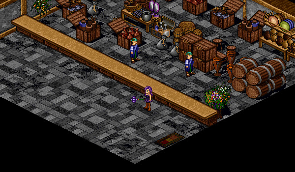

# Armour Dyeing

<figure>
  
  <figcaption>Mileth Tailor</figcaption>
</figure>

You can dye many armours by speaking to an armour dyer. When you dye armour, the colour changes and the dyed armour will give you more health. However, there is a chance that the armour will be destroyed when attempting to dye it. You must be of the same class as the type of armour you are trying to dye (ex: a Wizard to dye Wizard armour).

## Dyers

| **Name** | **Location** |
| - | - |
| Mileth Dyer | Mileth Tailor |
| Rucesion Dyer | Rucesion Tailor |
| Loures Dyer | Loures Treasury | 
| Suomi Dyer | Suomi Weapon Dealer |

## Effect

| **Armour Level** | **Dyeing Bonus** |
| - | - |
| 5 | +50 HP |
| 11 | +100 HP |
| 41 | +200 HP |
| 71 | +500 HP |
| 97 | +700 HP |

