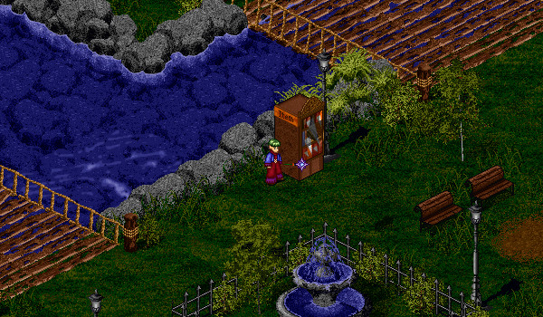

# Auction House

<figure>
  
  <figcaption>Mileth Auction House</figcaption>
</figure>

## Overview

The auction house allows you to bid on auctioned items and put up items of your own for auction. There are Auction Houses available in Mileth (83, 30), Abel (26, 5), Tagor (39, 67), and Rucesion (25, 35). Although players are able to run their own shops in the [Temuair Marketplace](../marketplace) for the cost of 2,000,000 Gold, any player is able to use the Auction House with only a very small upfront cost to the seller (100 Gold per item listed). All of the Auction Houses are connected, so you don't need to check the Auction Houses in each city for items.

You can browse the Auction House by clicking on the Auction House and selecting "Browse the Auction". You can see the current bid price, but if you select the item and click "OK", you can make a bid and see additional information, such as the buyout price.

In order to auction one of your own items, drag the item onto the Auction House to start the auction listing process.

