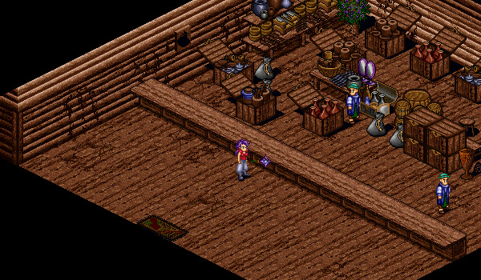

# Backpack

<figure>
  
  <figcaption>Mileth Tailor</figcaption>
</figure>

## Obtaining a Backpack

Each Aisling can obtain one backpack for free from any Tailor in Temuair. Simply speak to a Tailor and ask about "Backpacks".

## Usage

### Storage

The backpack functions as a small bank that is carried by the player. The player can put items into the backpack and withdraw them later. The items in the backpack do not contribute their weight to the player carrying the backpack. Additionally, if you perish, any items in your backpack will be protected from being destroyed.

It may be convenient to store items in large stacks in the backpack: reds, smoke bombs, songs, etc. It may also be useful to store stackable items of high value found when hunting, so that they can be sold later.

### Journal

The backpack has the ability to function as a journal. Importantly, when you select "Review Journal" you're able to see the following attributes:

- Base and equipped statistics
- Experience bonus
- Drop rate bonus
- Vampirism
- Item discoveries
- [Skill enhancements](../../classes/specializations)

## Upgrading the Backpack

Your backpack starts with three pockets, allowing you to place three different types of items in the backpack. However, you can store multiple copies of the same item in the backpack, such as smoke bombs or red potions. If you would like to upgrade the backpack, you need to gather resources and speak to any Tailor in Temuair. Each time you upgrade the backpack, an additional pocket will be added to the backpack.

| Upgrade | Resources |
|- | - |
| First | 50 Wolf Fur |
| Second | 50 Wolf Fur |
| Third | 50 Wolf Fur |
| Fourth | 25 Great Bat's Wing |
| Fifth | 25 Great Bat's Wing |
| Sixth | 10 Brawlerfish Scale |
| Seventh | 10 Brawlerfish Scale |
| Eigth | 10 Brawlerfish Scale |
| Nineth | 10 Brawlerfish Scale |

