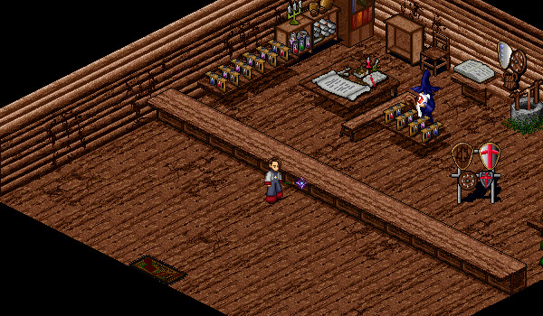

# Book of Sages and Memories

<figure>
  
  <figcaption>The Wizard Hecht in the Tagor Dark Wizard Shop</figcaption>
</figure>

At level 41 you can choose to acquire either the Book of Sages or Book of Memories from Hecht in the Tagor Dark Wizard shop in Tagor. You will be able to acquire the other book once you Master.

## Book of Sages

When equipped, provides +3 Int and allows the user to cast spells while moving. If you plan on subclassing and are struggling to find enough stat points, the +3 Int provided by this book may be very helpful.

## Book of Memories

 

When equipped, gives the user an ability that allows them to create memories of locations and later open portals to these locations. An Aisling can only have 5 locations memorized at a time and these locations can be almost anywhere. It costs 250,000 Gold to purchase a Memory Stone from the Mileth White Mage. These stones are consumed when making a new memory or opening a portal to a previous memory. Anyone can enter these portals (even if ungrouped). When you forget your memories, you must forget all of them simultaneously, you cannot choose a specific memory to forget.

