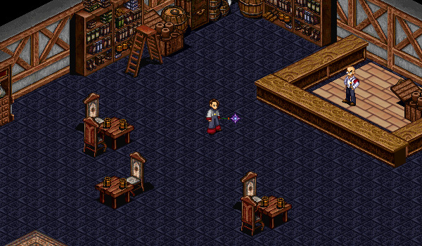

# Labour

<figure>
  
  <figcaption>Temuair Labour Authority</figcaption>
</figure>

## Mechanics

You get 12 "Temuair" days of labour every real-world day. Unused labour is not carried over and is replenished every 24 hours, based on the time your character was created.

## Temuair Labour Authority

At the Temuair Labour Authority, which is located in the [Temuair Marketplace](../marketplace) (within Loures), you can obtain Transfer Papers and Working Papers.

- **Transfer Papers**: Allow you to transfer 1 day of labour to the character standing in front of you. You can obtain transfer papers once every 5 minutes and they are not transferable. Transfer Papers stack up to 10 times; after which, you cannot receive any more papers.
- **Working Papers**: Allow you to restore 1 day of labour to yourself. You can obtain working papers once every 30 minutes and they are not transferable.
