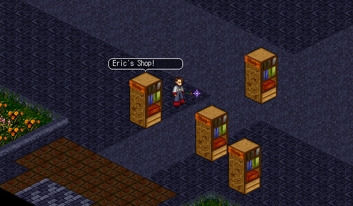

# Temuair Marketplace

<figure>
  
  <figcaption>Temuair Marketplace</figcaption>
</figure>

The Temuair Marketplace is accessable by travelling north at the Loures Castle entrance. At the marketplace, you can buy items from other players' shops or set up and manage your own shop. In order to set up your own shop, speak with Shop Manager Welshy. It costs 2,000,000 Gold to set up a shop.

