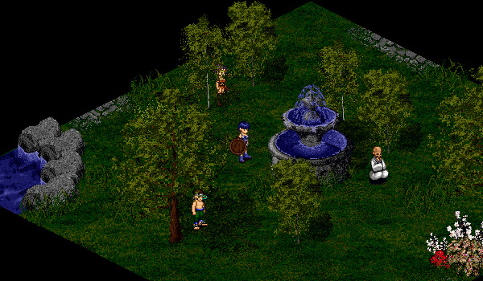

# Sapphire Stream

<figure>
  
  <figcaption>Sapphire Stream</figcaption>
</figure>

The Sapphire Stream is a Monk-only area located between Undine and Suomi. Speak with the Sapphire Guard in order to enter the Sapphire Stream.

## Dugon Trials

The Monk Mug Ruith will teach Monks the ways of the Dugon. This is done by proving oneself in a trial of combat that involves hunting down a monster and slaying it. Completing these Dugon Trials will unlock the ability to learn spells and skills associate with each Dugon rank. These abilities are learned through the Western Gate. You can also upgrade your Dugon trough the Northern Gate.

| Dugon | Level | Monster |
| - | - | - |
| White | 11 | Bat (Mileth Crypt) |
| Green | 22 | Crab (Piet Dungeon) |
| Blue | 33 | Turtle (Mehadi Swamp) |
| Yellow | 44 | ? |
| Purple | 55 | ? |
| Brown | 66 | ? |
| Red | 77 | ? |
| Black | 88 | ? |

## Sapphire Grove

The Sapphire Grove is a Monk-only solo instance. You can enter the instance by speaking with the Sapphire Druid at the Sapphire Stream.

