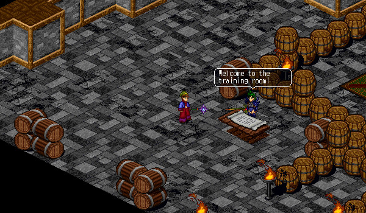

# Tagor Training Area

<figure>
  
  <figcaption>Tagor Training Area</figcaption>
</figure>

The Tagor Training area is a location where you can safely improve skills and see the damage you deal with your attacks. Speak with Andreas in order to enter the inside of the training area. It costs 100,000 Gold to train for 2 hours. Inside, there are training dummies with different elemental defenses and wells that you can click on to restore your mana.

