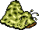

# Abel Dungeon

!!! attention

    The follow information is assembled from observation, not from data mining, and is not necessarily complete. If any item does not appear as a drop from a particular enemy on a particular floor, it doesn't mean it will not drop there.

| Enemny | Floors | Drops |
| - | - | - |
|    Leech | 1-1 | Blessed Gold Earrings   Ioc Deum   Blessed Amythest Ring |
| | 2-1 | Abundance Gold Earrings   Abundance Amythest Ring |
| | 2-2 | Ioc Deum |
|    Glupe | 1-1 | Ioc Deum   Abundance Iron Shield |
| | 2-1 | Ioc Deum   Graimail Beryl Earrings   Goo |
| | 2-2 | Goo |
| | 3-1 | Ioc Deum   Magus Diana |
| | 4-1| Mor Ioc Deum   Gramail Mythril Shield   Holy Diana   Cail Beryl Earrings |
|    Slug | 1-1 | Fiosachd Iron Greaves |
| | 2-1 | Luathas Shagreen Boots   Magic Cordovan Boots   Luathas Iron Greaves |
| | 2-2 | Might Shagreen Boots |
| | 3-1 | Magic Iron Greaves   Deoch Cordovan Boots |
| | 4-1 | Deoch Iron Greaves |
| | 5-1 | Glioca Shagreen Boots |
| | 6-1 | Deoch Gold Earrings |
|    Spore | 3-1 | Ioc Deum   Deoch Gold Earrings |
| | 4-1 | Sgrios Gold Earrings |
| | 5-1 | Mor Ioc Deum   Sgrios Gold Earrings |
| | 6-1 | Sgrios Gold Earrings |
| | 7-1 | Wind Bone Necklace   Cail Gold Earrings   Spore Sac   Might Jade Ring   Blessed Lapis Ring |
|    Polyp | 5-1 | |
| | 6-1 | Magic Iron Shield |
| | 7-1 | Polyp Sac   Fiosachd Beryl Earrings   Mor Ioc Deum   Wind Bone Necklace   Magus Zeus |
|    Dwarf | 7-1 | Deoch Mythril Greaves   Dwarvish Helmet   Cail Saffian Boots |

