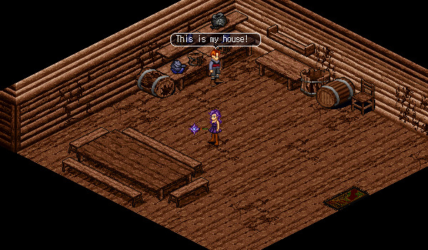
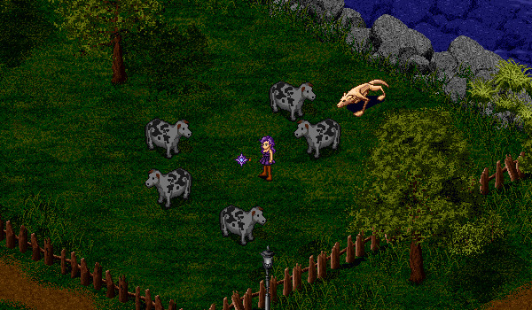

# Broken Pen

<figure>
  
  <figcaption>Taldur of Mileth</figcaption>
</figure>

Taldur of Mileth (18, 85) is looking for someone to take care of a wolf that has gotten into a local farm through a broken fence. He wants you to slay the wolf and then he will patch the fence.

<figure>
  
  <figcaption>The Broken Fence</figcaption>
</figure>

Head to the farm next to the Mileth White Mage and stand near the bench (34, 20). You will be teleported into the fenced area. You will have to slay the wolf in order to complete the quest and leave the area. The wolf is not aggressive, but can be dangerous if you're a low level.

<figure>
  
  <figcaption>The Wolf of Mileth</figcaption>
</figure>

After you slay the wolf, Taldur will speak with you through a pop-up and give you your reward. You do not need to return back to his home.

