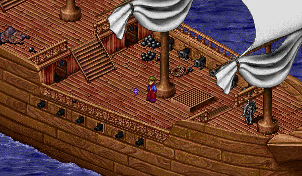

# Flatskull's Fleet

<figure>
  
  <figcaption>The Flagship of Flatskull's Fleet</figcaption>
</figure>

## Overview

Captain Aham of Lynith Beach (South Lynith Beach) would like you to sneak onto Captain Flatskull's flagship and steal some items while the pirates are sleeping. He will place you on the Ship's Deck, where you will need to make your way to the Captain's Quarters (accessible through the Main Hall - 18, 18). In the Captain's Quarters, pick up the Captain's Patch off the floor, as well as any Dubloons that might also be on the floor.

After picking up the Captain's Patch, many pirates will wake up, and you will have to go around the ship and slay 20 Scurvy Pirates. The Scurvy Pirates have no elemental defense. After slaying the pirates, make your way to the Mess Hall, and click on a table with glasses on the north side of the room (13, 2). You will drink from the glasses and permanently gain 250 HP and 150 MP. This can only be done once on your character.

Make your way to the Canteen and speak with the Pirate Merchant. You can browse his wares, where he will trade Dubloons for items, or tell him you saw some strangers. Thinking that you're a pirate, he will give you the code to the pirates' safe and ask you to move the Treasure Map for safe keeping. You should take note of this code, as it changes every time you do the instance and you will need it to open the safe upstairs.

Head back to the Ship's Deck and into the Bridge, where you will find the pirates' safe in the corner of the room. Click on the safe, enter the code, and the Pirate Treasure Map will drop at your feet. Pick up this map and it will immediately be taken by Captain Aham.

Unfortunately, Captain Flatskull has woken up in the Captain's Quarters and you will need to travel back down to defeat him. Captain Flatskull is protected by several Scurvy Pirates, but you only need to defeat the captain to continue. Both the captain and the pirates have elemental defenses.

After you defeat the captain, return to the Ship's Deck (30, 11) and escape the ship.

This quest can be completed every 8 hours and rewards 350,000 XP 350,000 Gold, and 5 Dubloons each time it is completed, as well as any other Dubloons you find on the pirate ship.

## Pirate Merchant

The Pirate Merchant in the Canteen will trade items for Dubloons.

| **Item** | **Dubloon Cost** |
| - | - |
| [Pirate Dagger](../../weapons/all) | 10 |
| [Flatskull's Flail](../../weapons/warrior) | 500 |

