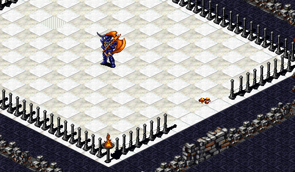

# The Gauntlet

<figure>
  
  <figcaption>The Temuair Gauntlet in Loures</figcaption>
</figure>

The Temuair Gauntlet can be found by entering a path on the south side of Loures Castle (0, 32). In order to enter the Gauntlet, speak with Gael inside the Gauntlet Entry. You will be able to enter the Gauntlet every 3 hours for a cost of 100,000 Gold.

Once inside the gauntlet, you will have to defeat five waves of enemies and visit the checkpoints before time runs out (20 minutes). In order to complete the gauntlet, you will need to assail the treasure chest that appears after the Champion is defeated.

| Wave | Enemies | Key Dropped | Notes | 
| - | - | - | - |
| 1 | Gauntlet Rats | Leaf Key | Easy to defeat |
| 2 | Gauntlet Bats | Red Key |  |
| 3 | Gauntlet Goblin | Marble Key | Dark defense |
| 4 | Gauntlet Dwarf | Peace Key | Dark defense, cast pramh |
| 5 | Loures Champion |  | Dark defense, strong attack |

While the first two waves are rather straightforward, waves 3, 4, and 5 can be tricky, because of the dark defense. Depending on your class and strength, it may be helpful to poison the enemies, or fight indirectly with spells or traps.

Sometimes keys will drop from defeated enemies. These keys can be used to open the chests behind Gael by assailing them, if you have the correct key. These chests often contain health and mana potions.

If you complete the gauntlet successfully for the first time, you will be rewarded with a Cap or Band of Danaan (depending on gender). The headgear provides a bonus to each stat of either +1 or +2, with a variety of possibilities (ex: +1/+2/+2/+2/+1). If you wish, you may destroy your headgear by speaking with Gael, and later attempt the gauntlet again to receive another random Cap or Band of Danaan.

The gauntlet awards a total of 871,000 quest XP when completed entirely. It will also reward a random item for completion, as well as whatever rewards you find in the chests.

