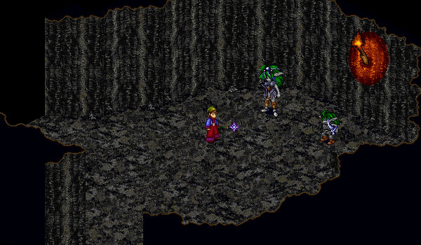

# Grimlock Quests

<figure>
  
  <figcaption>The Grimlock Queen in the Grimlock Queen's Lair</figcaption>
</figure>

All Grimlock quests are started at the Grimlock Queen. The Grimlock Queen can be found in the Grimlock Queen's Lair, which is found by travelling through Pravat Cave 1-1 (49, 33). In order to speak with the Grimlock Queen, you will need to ally yourself with Grimlocks. This can be done by speaking with Ethan at Pravat Cave entrance (27, 14).

## Fight Goblins

You will need to slay any 10 Goblins in Pravat Cave and return to the Grimlock Queen for your reward. The reward is 50,000 Gold.

## Precious Gems

You will need to collect 1 Finished Ruby, 1 Finished Coral, and 1 Finished Beryl. Return the gems to the Grimlock Queen for your reward. You will receive a variable amount of gold, equal to (Grimlock Honour) * 100.

## Rare Weapons

You will need to obtain a rare Goblin Guard Club from one of the Pravat Goblins. Slay Goblins until the Goblin Guard Club appears in your inventory. Return to the Grimlock Queen and receive gold for completing the quest. You will receive gold equal to (Grimlock Honour) \* 100.

## The Talos Mine

