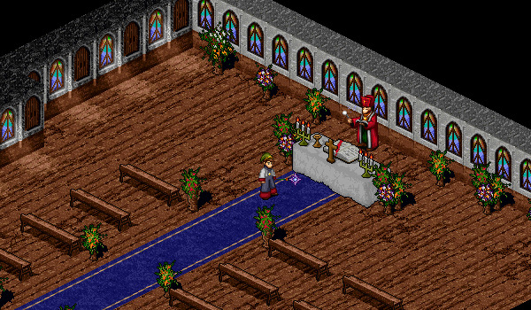
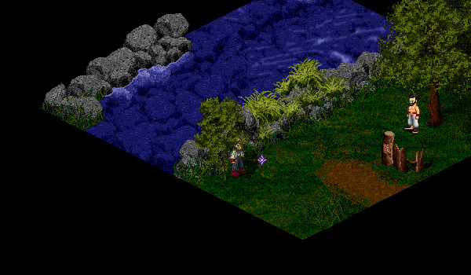

# Holy Water

<figure>
  
  <figcaption>The Mileth Priest in Mileth Church</figcaption>
</figure>

The Mileth Priest in Mileth Church would like you to obtain Holy Water from Sapphire Stream (near Suomi). He gives you an empty vial and asks you to fill the vial with water from Sapphire Stream. Travel to the Sapphire Crossing at Sapphire Stream and stand next to the stream (7, 10) to fill the vial. Return to Mileth and obtain your reward.

<figure>
  
  <figcaption>The Location to Obtain Water at Sapphire Crossing</figcaption>
</figure>

This quest can be completed daily and rewards XP and Gold equal to: (Level * 1000) + (TimesCompleted * 1500)

