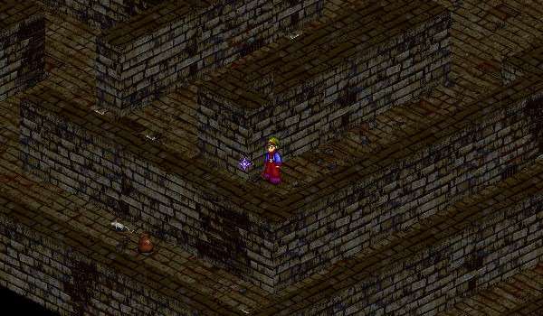

# Mileth Cellar

<figure>
  
  <figcaption>The Mileth Cellar</figcaption>
</figure>

The Town Drunk of Mileth Tavern is having some problems with the tavern's cellar and would like some help. He would like you to clean up the food and drinks, as well as deal with the rats that have infested the place. Agree to help the Town Drunk and he will teleport you into the Mileth Tavern Cellar.

First, travel around the map and collect any combination of 5 musty fruits (cherries or apples). Next, collect any combination of 5 aged drinks (ale, rum, or wine). Finally, return to the cellar entrance and the Town Drunk will help you leave the cellar.

The quest rewards 25,000 Gold and experience, reglardless of level or number of times completed. Additionally, it is possible for some Talos Fragments to drop in the cellar. However, they are somewhat rare.

