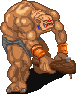

# Tauren Creant

The Tauren Creant quest involves using a Kelberoth Lock and Goblin Chief's Gauntlet to summon and defeat Tauren. Completing the Taurent Creant quest is part of [Grand Mastering](../../classes/grand_mastering) and is required to [transcend](../../classes/transcending) your class.

## Quest

In order to summon Tauren, you will need to collect:

- Kelberoth Lock
- Goblin Chief's Gauntlet

This [Mount Giragan map](http://www.vorlof.com/maps/mountgiragan.html) (external site) may be helpful when navigating the Mount Giragan.

### Kelberoth Lock

In order to obtain a Kelberoth Lock, will need to travel to the Kelberoth Ice Caves and defeat the Kelberoth.

You can reach the Kelberoth Ice Caves by first travelling to Mount Giragan and continuing until the Mt. Giragan 6 intersection room, travelling north until Mt. Giragan 18, and then travelling west until Mt. Giragan 21. The entrance to the caves is on the western wall.

In order to summon a Kelberoth, you must find Wolf Bait, which has a somewhat low chance of dropping from Giragan Wolves in the Ice Caves. You will need one Wolf Bait for every member of your party. Take the Wolf Bait to Ice Cave 4 and summon a Kelberoth by walking into the center of the room with the bait in your inventory.

#### Kelberoth

The Kelberoth will repeatedly cast a wave spell directly in front of him, so you may want to face him away from the other members of your party. You should cast Ard Cradh on him and keep him Suain'd as much as possible.

The Kelberoth has Dark defense.

### Goblin Chief's Gauntlet

In order to obtain a Goblin Chief's Gauntlet, will need to travel to the Goblin Ice Caves and defeat the Goblin Chief.

The Goblin Ice Caves can be accessed by travelling south from Mt. Giragan 6 until Mt. Giragan 27, travelling east until Mt. Giragan 30, and then entering the caves, which are located along the eastern wall. You will need to obtain the Chief's Notes in the caves in order to summon the Goblin Chief.

#### Chief's Notes

You will first need to obtain the Chief's Notes, which can be obtained by speaking with the Goblin Scout in Goblin Fort Ung Oh'k, which is accessed by travelling north through Ice Cave 15. You will need to say "Notes" out loud. These notes can be used to summon the Goblin Chief.

#### Goblin Chief

The Goblin Chief is summoned in "Ice Cave", which is accessed by travelling north continually from Ice Cave 14, until you reach a room with a throne and treasure. You summon the Chief by standing near the throne.

The Goblin Chief will repeatedly cast a wave spell directly in front of him, so you may want to face him away from the other members of your party. You should cast Ard Cradh on him and keep him Suain'd as much as possible.

The Goblin Chief has Dark defense.

### Tauren Creant Fight

The Tauren is summoned in the Ice Caves Altar room, which is accessed at the end of the Tauren Ice Caves. You can reach the Tauren Ice Caves by travelling to Mt. Giragan 12, and eventering the caves on the southern wall.

Skeletons will continue to randomly spawn in the room. They will have Dark defense and Dark attack, but occassionally cast Light spells, so you may wish to wear a Dark belt, but not be Fas'd.

The Tauren is summoned by standing in front of the ice with a Kelberoth Lock and a Goblin Chief's Gauntlet in your inventory. Tauren has Dark defense and Dark attack. You will need to recast debuffs in the fight, as Tauren will remove them regularly from himself. Keeping Suain cast on Tauren will make the fight much easier.

## Rewards

The rewards for each class are as follows:

| Class | Reward |
| - | - |
| Monk | Bracer |
| Priest | Robes |
| Rogue | Greaves |
| Warrior | Weapons |
| Wizard | Robes |

