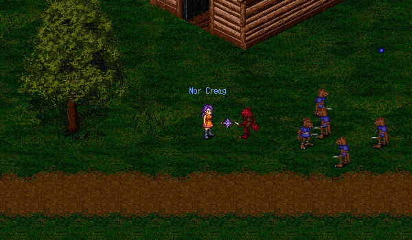

# Undiam Village

<figure>
  
  <figcaption>The Undiam Village</figcaption>
</figure>

Undiam Village is a repeatable, Wizard-only, solo instance accessible by speaking with Rodan at the Undine Wizard. Rodan will take you inside the Undiam Village and you will have to defeat a wave of 20 Undiam Kobolds, followed by collecting 10 Undiam Ore Fragments off the ground, before finally defeating the Kobold Chief boss and exiting the instance. The instance rewards good, level-appropriate experience and resets every 4 hours, so you may wish to complete the instance frequently for experience.

Undiam Ore Fragments may be converted into Undiam Ore by speaking with Rodan and these ores can be exchanged with Rodan for items.

## Rewards

| **Item** | **Number of Ore** |
| - | - |
| Magus Apollo | 15 |
| Magus Ares | 15 |
| Magus Gaea | 15 |
| Magus Kronos | 15 |
| Magus Zeus | 15 |
| Undian Staff | 500 |

